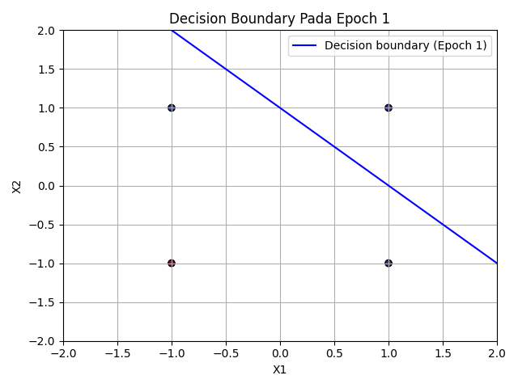
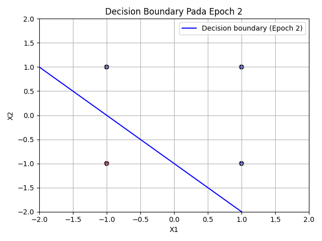
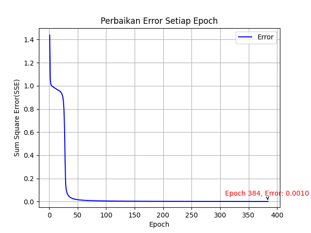

# Praktikum Kecerdasan Buatan Pertemuan 6

## Jaringan Syaraf Tiruan: Perceptron dan Backpropagation

Program ini dibuat untuk menyelesaikan studi kasus pada modul praktikum pertemuan 6 tentang Jaringan Syaraf Tiruan (JST). Terdapat dua studi kasus utama:

1. Masalah OR menggunakan algoritma Perceptron.
2. Masalah XOR menggunakan algoritma Backpropagation.

Kedua studi kasus menggunakan data bipolar, yaitu nilai input dan target berada pada rentang `-1` dan `1`.

## Struktur File

```text
Pertemuan6/
|-- Perceptron.py
|-- Perceptron_or.py
|-- Backpropagation.py
|-- Backpropagation_xor.py
|-- HasilPerceptron.txt
|-- HasilBackpropagation.txt
`-- ss/
    |-- Perceptron-Figure1.png
    |-- Perceptron-Figure2.png
    |-- Perceptron-Figure3.png
    `-- Backpropagation.png
```

Keterangan file:

| File | Keterangan |
| --- | --- |
| `Perceptron.py` | Berisi class `Perceptron` untuk proses training data OR. |
| `Perceptron_or.py` | File utama untuk menjalankan studi kasus OR. |
| `Backpropagation.py` | Berisi class `Backpropagation` untuk proses training data XOR. |
| `Backpropagation_xor.py` | File utama untuk menjalankan studi kasus XOR. |
| `HasilPerceptron.txt` | File hasil perhitungan training Perceptron. |
| `HasilBackpropagation.txt` | File hasil perhitungan training Backpropagation. |
| `ss/` | Folder gambar hasil visualisasi program. |

## Library yang Digunakan

Program menggunakan dua library utama:

```python
import numpy as np
import matplotlib.pyplot as plt
```

Fungsi library:

| Library | Fungsi |
| --- | --- |
| `numpy` | Mengolah array, perkalian matriks, bobot, bias, error, dan fungsi aktivasi. |
| `matplotlib` | Menampilkan grafik decision boundary dan grafik penurunan error. |

## Studi Kasus 1: OR dengan Perceptron

### Konsep Perceptron

Perceptron adalah jaringan syaraf tiruan single layer yang digunakan untuk klasifikasi data yang dapat dipisahkan secara linear. Pada studi kasus ini, Perceptron digunakan untuk mengenali pola logika OR dengan data bipolar.

Data OR yang digunakan:

| x1 | x2 | Target |
| --- | --- | --- |
| 1 | 1 | 1 |
| 1 | -1 | 1 |
| -1 | 1 | 1 |
| -1 | -1 | -1 |

Parameter yang digunakan:

| Parameter | Nilai |
| --- | --- |
| Learning rate | `0.1` |
| Max epoch | `10` |
| Bobot awal | `0` |
| Bias awal | `0` |
| Fungsi aktivasi | Bipolar |

### Rumus Perceptron

Nilai net input atau `y_in` dihitung dengan:

```text
y_in = b + (x1 * w1) + (x2 * w2)
```

Fungsi aktivasi bipolar:

```text
Jika y_in >= 0, maka y = 1
Jika y_in < 0, maka y = -1
```

Error:

```text
error = target - y
```

Perubahan bobot:

```text
delta_w = alpha * error * x
w_baru = w_lama + delta_w
```

Perubahan bias:

```text
delta_b = alpha * error
b_baru = b_lama + delta_b
```

Kondisi berhenti:

```text
Training berhenti jika SSE = 0 atau max epoch tercapai.
```

### Alur Program Perceptron

1. Program menginisialisasi bobot dan bias dengan nilai `0`.
2. Setiap data input dihitung nilai `y_in`.
3. Nilai `y_in` diaktivasi menggunakan fungsi aktivasi bipolar.
4. Output prediksi dibandingkan dengan target.
5. Jika terjadi error, bobot dan bias diperbarui menggunakan delta rule.
6. Setelah seluruh data diproses dalam satu epoch, program menghitung SSE.
7. Program menampilkan decision boundary setiap epoch.
8. Training berhenti ketika SSE bernilai `0`.

### File Perceptron.py

File `Perceptron.py` berisi class utama untuk algoritma Perceptron. Method penting di dalam file ini:

| Method | Fungsi |
| --- | --- |
| `__init__()` | Menyimpan learning rate, max epoch, dan pengaturan plot. |
| `weighted_sum()` | Menghitung nilai `y_in`. |
| `predict()` | Menghasilkan output berdasarkan fungsi aktivasi bipolar. |
| `plot_decision_boundary()` | Menampilkan garis pemisah data pada setiap epoch. |
| `fit()` | Menjalankan proses training Perceptron. |

### File Perceptron_or.py

File ini digunakan untuk menjalankan studi kasus OR. Isi utamanya adalah inisialisasi input, target, pembuatan model, dan pemanggilan method `fit()`.

```python
model = p.Perceptron(alpha=0.1, epoch=10)
model.fit(X, t)
```

### Hasil Training Perceptron

Hasil training Perceptron:

| Epoch | SSE | Keterangan |
| --- | --- | --- |
| 1 | `4.0` | Masih terdapat error pada data ke-4. |
| 2 | `8.0` | Bobot dan bias masih disesuaikan. |
| 3 | `0.0` | Semua output sudah sesuai target. |

Training berhenti pada epoch ke-3 karena `SSE = 0.0`.

Bobot dan bias akhir:

```text
Bobot akhir : [0.2 0.2]
Bias akhir  : 0.2
```

### Visualisasi Perceptron

Decision boundary pada epoch 1:



Decision boundary pada epoch 2:



Decision boundary pada epoch 3:


Pada gambar terlihat bahwa garis pemisah berubah mengikuti perubahan bobot dan bias. Pada epoch ke-3, model sudah mampu memisahkan data OR dengan benar.

## Studi Kasus 2: XOR dengan Backpropagation

### Konsep Backpropagation

Backpropagation adalah algoritma pembelajaran jaringan syaraf tiruan multilayer. Berbeda dengan Perceptron yang hanya memiliki single layer, Backpropagation memiliki hidden layer sehingga dapat menyelesaikan masalah yang tidak dapat dipisahkan secara linear, seperti XOR.

Data XOR yang digunakan:

| x1 | x2 | Target |
| --- | --- | --- |
| 1 | 1 | -1 |
| 1 | -1 | 1 |
| -1 | 1 | 1 |
| -1 | -1 | -1 |

Parameter yang digunakan:

| Parameter | Nilai |
| --- | --- |
| Learning rate | `0.3` |
| Max epoch | `1000` |
| Target error | `0.001` |
| Jumlah input neuron | `2` |
| Jumlah hidden neuron | `2` |
| Jumlah output neuron | `1` |
| Fungsi aktivasi | `tanh` |

Bobot dan bias awal dibuat secara random pada rentang `0` sampai `1`. Pada program ini digunakan `random_state=272` agar hasil training dan grafik konsisten saat dijalankan ulang.

### Arsitektur Backpropagation

Arsitektur jaringan:

```text
Input layer   : 2 neuron
Hidden layer  : 2 neuron
Output layer  : 1 neuron
```

Alur data:

```text
x1, x2 -> hidden layer -> output layer -> y
```

### Fungsi Aktivasi

Karena data yang digunakan adalah bipolar, fungsi aktivasi yang digunakan adalah `tanh`.

```text
y = tanh(x)
```

Turunan fungsi aktivasi:

```text
f'(x) = 1 - x^2
```

Pada program, nilai `x` pada turunan adalah output hasil aktivasi `tanh`.

### Forward Propagation

Forward propagation adalah proses menghitung output jaringan dari input sampai output layer.

Operasi input ke hidden layer:

```text
h_in = b_hidden + X * w_hidden
```

Aktivasi hidden layer:

```text
h = tanh(h_in)
```

Operasi hidden layer ke output layer:

```text
y_in = b_output + h * w_output
```

Aktivasi output layer:

```text
y = tanh(y_in)
```

### Backward Propagation

Backward propagation adalah proses memperbaiki bobot dan bias berdasarkan error output.

Error output:

```text
error = target - y
```

Delta output:

```text
d_y = error * (1 - y^2)
```

Error hidden layer:

```text
error_h = d_y * transpose(w_output)
```

Delta hidden layer:

```text
d_h = error_h * (1 - h^2)
```

Update bobot output:

```text
w_output = w_output + (transpose(h) * d_y * alpha)
```

Update bias output:

```text
b_output = b_output + (sum(d_y) * alpha)
```

Update bobot hidden:

```text
w_hidden = w_hidden + (transpose(X) * d_h * alpha)
```

Update bias hidden:

```text
b_hidden = b_hidden + (sum(d_h) * alpha)
```

### File Backpropagation.py

File `Backpropagation.py` berisi class utama untuk algoritma Backpropagation. Method penting di dalam file ini:

| Method | Fungsi |
| --- | --- |
| `__init__()` | Menyimpan parameter, jumlah neuron, serta membuat bobot dan bias random. |
| `bi_sigmoid()` | Menerapkan fungsi aktivasi bipolar menggunakan `tanh`. |
| `deriv_bi_sigmoid()` | Menghitung turunan fungsi aktivasi `tanh`. |
| `plot_error()` | Menampilkan grafik penurunan SSE setiap epoch. |
| `fit()` | Menjalankan training Backpropagation. |

### File Backpropagation_xor.py

File ini digunakan untuk menjalankan studi kasus XOR. Isi utamanya adalah inisialisasi input, target, pembuatan model, dan pemanggilan method `fit()`.

```python
model = b.Backpropagation(alpha=0.3, epoch=1000, target_error=0.001)
model.fit(X, t)
```

### Hasil Training Backpropagation

Hasil training Backpropagation:

```text
Learning rate : 0.3
Max Epoch     : 1000
Target Error  : 0.001
```

Training berhenti pada:

```text
Epoch ke-384
SSE = 0.0009975938157860422
```

Training berhenti karena nilai SSE sudah lebih kecil dari target error `0.001`.

### Visualisasi Backpropagation

Grafik berikut menunjukkan penurunan SSE pada setiap epoch:



Berdasarkan grafik, nilai error menurun secara signifikan dari awal training sampai mendekati `0`. Pada epoch ke-384, error sudah mencapai sekitar `0.0010`, sehingga proses training dihentikan.

## Cara Menjalankan Program

Pastikan Python dan library yang dibutuhkan sudah tersedia.

Install library jika diperlukan:

```bash
pip install numpy matplotlib
```

Menjalankan studi kasus OR:

```bash
python Perceptron_or.py
```

Output:

1. Tiga grafik decision boundary untuk epoch 1 sampai epoch 3.
2. File `HasilPerceptron.txt`.

Menjalankan studi kasus XOR:

```bash
python Backpropagation_xor.py
```

Output:

1. Satu grafik penurunan error setiap epoch.
2. File `HasilBackpropagation.txt`.

## Kesimpulan

Berdasarkan hasil program:

1. Perceptron berhasil menyelesaikan masalah OR karena data OR dapat dipisahkan secara linear.
2. Perceptron berhenti pada epoch ke-3 karena seluruh prediksi sudah sesuai target.
3. Backpropagation berhasil menyelesaikan masalah XOR karena menggunakan hidden layer.
4. Backpropagation berhenti pada epoch ke-384 karena SSE sudah lebih kecil dari target error.
5. Visualisasi pada folder `ss` menunjukkan proses pembelajaran model, baik melalui perubahan decision boundary maupun penurunan error.
